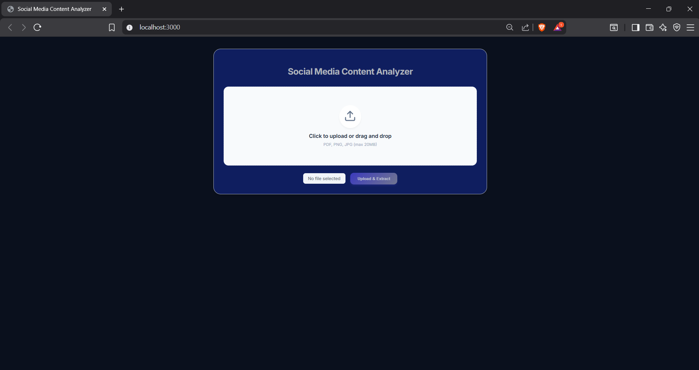
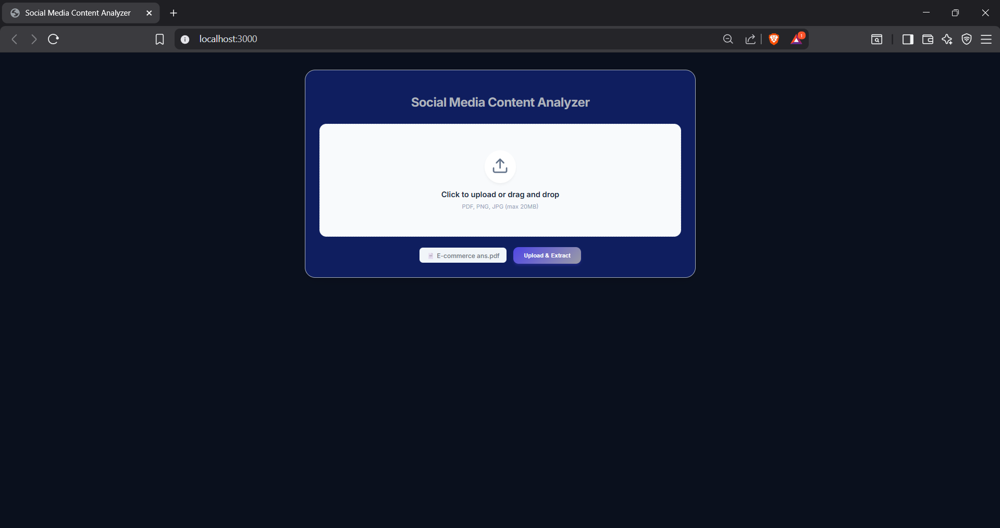
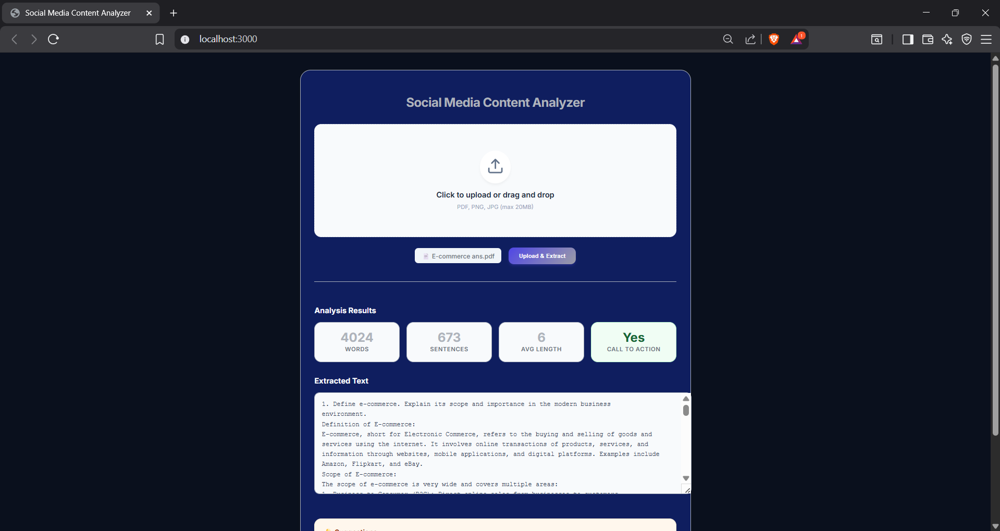
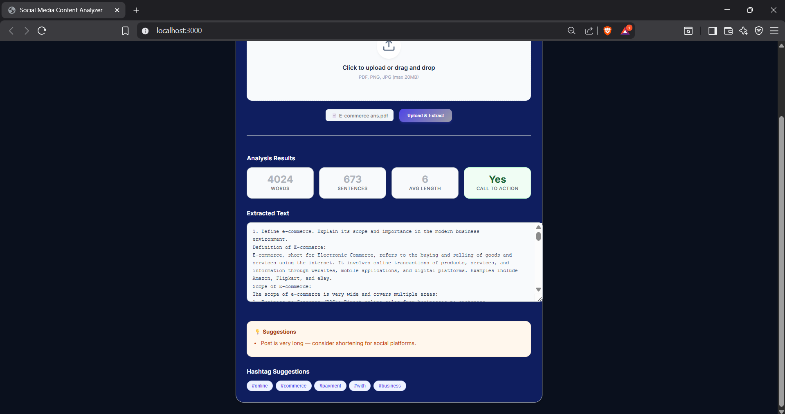

#  Social Media Content Analyzer  
A simple web application that allows users to upload PDF files or images and extracts text from them using PDF parsing and OCR (Tesseract.js).  
After extracting the text, the app gives **engagement improvement suggestions** for social media content.

##  Approach
In this project, I set out to create a lightweight yet effective application capable of extracting text from PDFs or images and offering helpful suggestions to improve the content. I focused on a modular design to ensure that both the backend and frontend stayed clean, maintainable, and easy to extend.

On the backend, I built the server using Express.js and structured the logic into dedicated controllers and services. PDF files are processed with pdf-parse, while image-based text extraction is handled through Tesseract.js for OCR. File uploads are managed with Multer, and once the text is extracted, a custom analysis module reviews the content—checking word count, sentence quality, calls to action, and generating hashtag recommendations. All functionalities are exposed through routes under /api.

For the frontend, I developed a simple and intuitive React interface that supports drag-and-drop uploads, displays real-time upload progress, and shows the extracted text along with the analysis results. The frontend sends files to the backend using XMLHttpRequest to track upload progress, and once the response is received, the UI presents the insights in a clear, organized layout.

##  Features

###  1. File Upload  
- Upload PDF, JPG, PNG, JPEG  
- Drag-and-drop support  
- Shows selected file name  
- Handles errors for unsupported files  

###  2. Text Extraction  
- PDF Parsing using `pdf-parse`  
- OCR for images using `tesseract.js` (Node compatible version)  
- Extracts raw text and cleans formatting  

###  3. Content Analysis  
After extracting text, the analyzer evaluates:  
- Word count  
- Sentence count  
- Average sentence length  
- Presence of Call-To-Action  
- Hashtag suggestions  
- Improvement tips for better engagement  

###  4. User Interface  
- Clean and simple UI  
- Progress bar while uploading  
- Error messages  
- Displays extracted text  
- Shows suggestions and hashtags  

---

##  Project Structure (Backend + Frontend)

```
backend
│
├── controllers
│ ├── analyzeController.js
│ ├── ocrController.js
│ ├── pdfController.js
│ └── uploadController.js
│
├── app.js
└── routes.js

frontend
│
└── src
├── components
│ ├── FileDrop.js
│ ├── Progress.js
│ └── ResultPanel.js
│
├── pages
│ └── Home.js
│
├── services
│ └── apis.js
│
├── utils
│ └── textUtils.js
│
└── App.js
```


##  Tech Stack Used

### Frontend
- React 
- JavaScript
- HTML/CSS
- Axios / XHR

### Backend
- Node.js
- Express.js
- Multer (file uploads)
- pdf-parse
- tesseract.js
- CORS

---

##  How to Run the Project Locally  

### Clone the repository

- git clone <your-repo-url>
- cd <project-folder>


---

###  Backend Setup
- cd backend
- npm install
- npm run dev

---

###  Frontend Setup
- cd frontend
- npm install
- npm run start

---

## Screenshots 


### 1.  Home Page UI


---

### 2.  File Upload

---

### 3.  Extracted Text Output


---

### 4.  Analysis & hashtags


 


